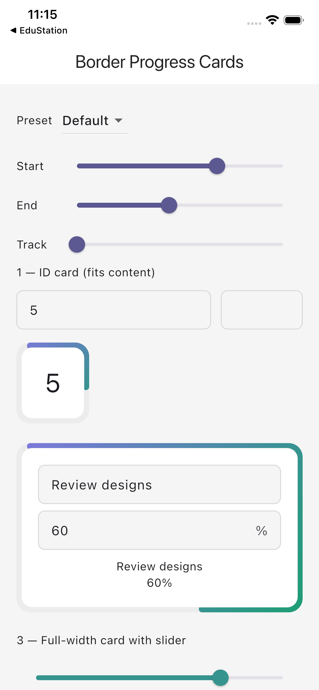
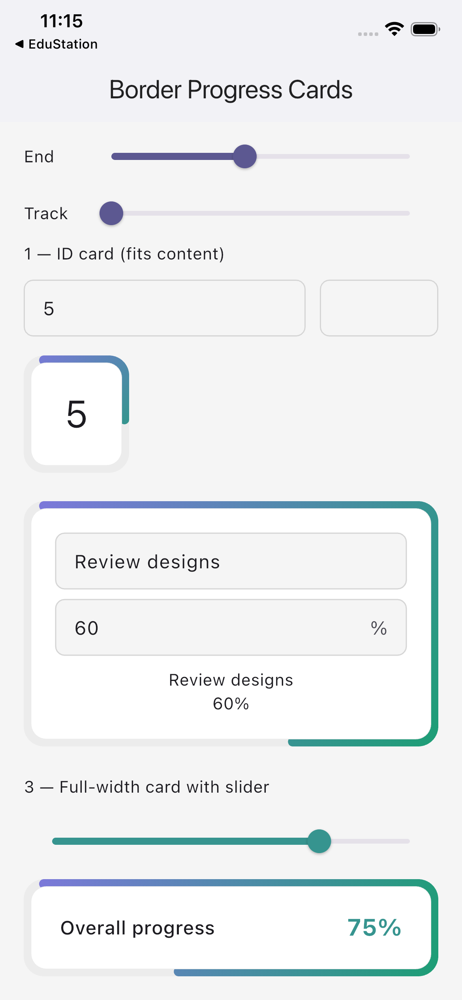

# progress_card

A customizable bordered progress card widget for Flutter.

[](https://pub.dev/packages/progress_card)

<p float="left">
  
  
</p>

## Features

- Rounded border progress indicator around any child widget
- True linear gradient painted along the progress stroke
- Configurable gradient colors, track color, stroke width, corner radius, and gap
- Lightweight — only depends on `flutter`

## Install

```yaml
dependencies:
  progress_card: ^0.2.2
```

## Usage

```dart
import 'package:progress_card/progress_card.dart';

BorderProgressCard(
  percentage: 0.65,
  strokeWidth: 8,
  borderRadius: 14,
  progressStartColor: const Color(0xFF7F77DD),
  progressEndColor: const Color(0xFF1D9E75),
  child: const Padding(
    padding: EdgeInsets.all(20),
    child: Text('65%'),
  ),
)
```

Wrap in `IntrinsicWidth` to fit the card tightly around its content:

```dart
IntrinsicWidth(
  child: BorderProgressCard(
    percentage: 0.35,
    child: Padding(
      padding: const EdgeInsets.symmetric(horizontal: 28, vertical: 20),
      child: Text('ID 5', style: TextStyle(fontSize: 32)),
    ),
  ),
)
```

## API

| Parameter | Type | Default | Description |
|---|---|---|---|
| `percentage` | `double` | required | Progress from `0.0` to `1.0` (clamped). |
| `child` | `Widget` | required | Content drawn inside the card. |
| `strokeWidth` | `double` | `8.0` | Thickness of the progress/track stroke. |
| `borderRadius` | `double` | `13.0` | Corner radius for both stroke and card. |
| `progressStartColor` | `Color` | `0xFF7F77DD` | Gradient start color (top-left). |
| `progressEndColor` | `Color` | `0xFF1D9E75` | Gradient end color (bottom-right). |
| `trackColor` | `Color` | `0xFFECECEC` | Color of the inactive track. |
| `surfaceColor` | `Color` | `white` | Fill color of the card background. |
| `innerBorderColor` | `Color` | `0xFFECECEC` | Border color of the inner card. |
| `gap` | `double` | `2.0` | Space between the stroke and the card edge. |

### Notes

- Progress is drawn **clockwise from the top-left edge**.
- The gradient is a `LinearGradient` from `progressStartColor` (top-left) to
  `progressEndColor` (bottom-right), applied as a shader across the full widget
  bounds — so the colours are consistent regardless of how much progress is filled.

## Example app

A full interactive showcase app is in the `example/` folder. It demonstrates
three card variants, live color presets, and per-channel hue sliders.

```bash
cd example
flutter pub get
flutter run
```

## License

MIT — see [`LICENSE`](LICENSE).
